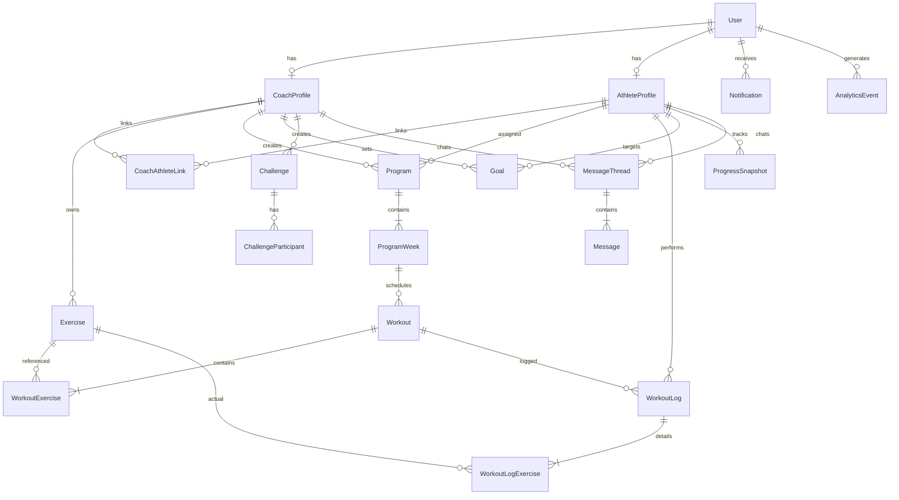

# Схема базы данных sport-app

> Версия: 13 июня 2026 · PostgreSQL 16 + pgvector

## ER-диаграмма (ядро)



## Таблицы

### Пользователи и связи

| Таблица | Назначение |
|---------|------------|
| `users` | Базовый аккаунт: phone (79106492742), pin_hash, role (athlete/coach/admin) |
| `coach_profiles` | Профиль тренера, invite_code для подключения спортсменов |
| `athlete_profiles` | Профиль спортсмена, timezone для push |
| `coach_athlete_links` | Связь тренер↔спортсмен (pending → active → paused/ended) |

### Тренировочный контент

| Таблица | Назначение | Backlog |
|---------|------------|---------|
| `exercises` | Библиотека упражнений (глобальные + персональные тренера) | T-03 |
| `programs` | Программа (шаблон или назначенная) | T-02 |
| `program_weeks` | Недели программы | T-02 |
| `workouts` | Запланированная тренировка | T-02, B-01 |
| `workout_exercises` | Упражнение в тренировке с целевыми параметрами | T-02 |
| `workout_logs` | Факт выполнения тренировки | B-01 |
| `workout_log_exercises` | Подходы, замены (A-01) | B-01, A-01 |

### Цели и прогресс

| Таблица | Назначение | Backlog |
|---------|------------|---------|
| `goals` | Цели тренера для спортсмена | P-03 |
| `progress_snapshots` | Агрегаты за период + аффективный feedback | P-02, P-04 |
| `challenges` | Челленджи с difficulty_config | P-05 |
| `challenge_participants` | Прогресс участника | P-05, S-01 |

### Коммуникация и аналитика

| Таблица | Назначение | Backlog |
|---------|------------|---------|
| `message_threads` | Диалог тренер↔спортсмен | C-01, C-02 |
| `messages` | Сообщения с контекстом (workout, goal, substitution) | C-01 |
| `notifications` | Push / in-app / email | DoD |
| `analytics_events` | Engagement-события | DoD |

## Ключевые решения

1. **Программа vs тренировка vs лог** — три уровня: план (workout) → факт (workout_log) → детали (workout_log_exercises). Это позволяет переносы (A-02) без потери истории.

2. **Замены упражнений** — `workout_log_exercises.substituted` + `exercise_id` (фактическое) vs `workout_exercise_id` (запланированное). Тренер видит замены (DoD).

3. **JSONB для гибкости** — `sets_data`, `metrics`, `difficulty_config`, `progress` — структурированные, но эволюционируемые без миграций на каждый новый тип метрики.

4. **coach_id на exercises** — NULL = глобальная библиотека платформы; иначе — персональная библиотека тренера.

5. **pgvector** — расширение включено с первой миграции для будущих AI-рекомендаций замен упражнений.

## Индексы (заложены в моделях)

- `users.email`, `users.role`
- `coach_athlete_links.coach_id`, `athlete_id`, `status`
- `workouts.scheduled_date`, `status`, `athlete_id`
- `workout_logs.athlete_id`, `workout_id`
- `goals.athlete_id`, `status`
- `analytics_events.event_name`, `user_id`

## Миграции

```bash
# из корня проекта
./scripts/dev.sh up
cd backend && pip install -e ".[dev]"
cp .env.example .env
alembic upgrade head
```

Создать новую миграцию после изменения моделей:

```bash
./scripts/dev.sh revision "описание"
./scripts/dev.sh migrate
```
