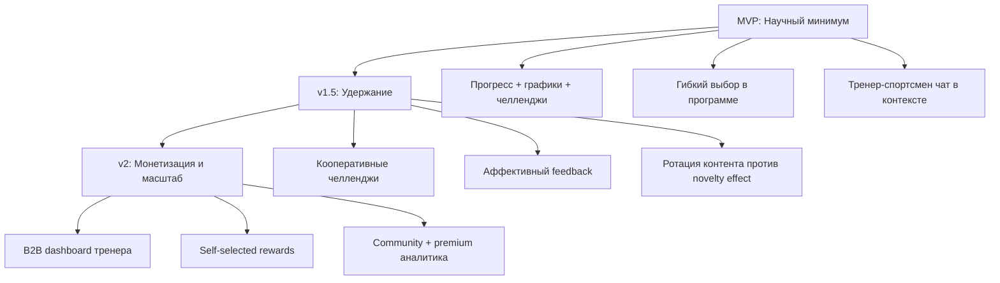

# История диалога: фитнес-приложение для тренера и спортсменов

> Восстановлено из оригинального чата Cursor (12 июня 2026).
> Полный технический транскрипт: `docs/archive/original-chat-transcript.jsonl`

---

## Вы

А можно тебя попросить....
мне нужен от тебя хорошо продуманный и структурированный совет. Я планирую делать мобильное приложение для фитнеса - для тренера и спортсменов. Мне нужны ключевые особенности, которые необходимо предусмотреть, опираясь исключительно на научные статьи и исследования.. Эти особенности, должны повысить использование приложение (регулярное), получение от использование приложения положительного опыта, повышения продаж и чтобы его хотели приобрести каждый) для примера вот подборка научных статей: https://www.connectedpapers.com/main/f7c0deaa1770aad72679c3cf2c730afa08446652/Gamification-in-sport-apps%3A-the-determinants-of-users'-motivation/graph И вот одна из статей тут /Users/alekseiarsenev/Downloads/ejmbe-09-2019-0163.pdf .... Ответ должен быть обоснованным, с подробным описанием по каждому пункту...

---

## Ассистент

Соберу рекомендации на основе вашей статьи и связанных исследований из Connected Papers — сначала прочитаю PDF и обзор по графу статей.

---

## Ассистент

Ищу связанные исследования из графа Connected Papers и дополнительные работы по фитнес-приложениям для тренеров и спортсменов.

---

## Ассистент

[REDACTED]

---

## Ассистент

[REDACTED]

---

## Ассистент

# Научно обоснованная архитектура фитнес-приложения для тренера и спортсменов

Ниже — структурированные рекомендации, выстроенные вокруг **теории самодетерминации (Self-Determination Theory, SDT)** — Ryan & Deci, 2000; Ng et al., 2012 — и эмпирических исследований геймификации в спортивных приложениях, включая вашу статью **Bitrián, Buil & Catalán (2020)** (*European Journal of Management and Business Economics*, DOI: 10.1108/EJMBE-09-2019-0163) и связанные работы из графа Connected Papers.

---

## Научная логика: что реально удерживает пользователей

Исследования сходятся на одном: **регулярное использование** и **положительный опыт** возникают не от «ещё одного трекера», а от удовлетворения трёх базовых психологических потребностей:

| Потребность | Смысл | Что это даёт продукту |
|---|---|---|
| **Компетентность** | «Я справляюсь, я прогрессирую» | Регулярные тренировки, ощущение результата |
| **Автономия** | «Я сам выбираю, как тренироваться» | Долгосрочная мотивация, не выгорание |
| **Связанность** | «Меня видят, поддерживают, я часть команды» | Удержание, сарафан, готовность платить |

**Ключевой вывод Bitrián et al. (2020)** на выборке 153 пользователей спортивных приложений (Strava, Garmin, Nike+ и др.):

- Элементы **достижений** (бейджи, очки, прогресс-бары, рейтинги, растущая сложность) → удовлетворяют **все три** потребности (β = 0.307–0.331, p < 0.001).
- **Социальные** элементы → в основном **связанность** (β = 0.721, p < 0.000) — самый сильный эффект в модели.
- **Иммерсивные** элементы (аватар, персонализация) → компетентность и автономия.
- **Автономная мотивация** (использовать приложение «потому что хочу») сильнее всего предсказывается **автономией** (β = 0.377) и **связанностью** (β = 0.162), а не компетентностью напрямую.
- **Эффект новизны**: чем дольше человек пользуется приложением, тем ниже автономная мотивация (β = −0.168) — Hamari et al., 2014; Koivisto & Hamari, 2014.

Для вашего продукта это означает: **ядро — прогресс + выбор + социальная связь с тренером**, а не просто «очки за шаги».

---

## Блок 1. Система прогресса и достижений (компетентность + автономия)

### 1.1. Многоуровневые челленджи с нарастающей сложностью

**Что делать:** персональные и групповые челленджи (шаги, подходы, дистанция, силовые показатели) с **постепенным усложнением** — не фиксированные цели «10 000 шагов для всех».

**Научное обоснование:**
- Bitrián et al. (2020): «increasingly difficult tasks» — значимый элемент achievement-related gamification.
- van Roy & Zaman (2019): еженедельные челленджи растущей сложности → компетентность, автономия, связанность.
- Peng et al. (2012): в exergame-исследовании задачи усложняются по мере роста навыка → чувство достижения.

**Почему это важно для бизнеса:** компетентность — главный драйвер **внутренней мотивации** в расширенном исследовании тех же авторов на 276 пользователях Fitbit (Bitrián et al., 2021): achievement-элементы → β = 0.645 к компетентности. А внутренняя мотивация, в свою очередь, → физическое (β = 0.606), ментальное (β = 0.530) и социальное здоровье (β = 0.452).

**Для тренера:** конструктор челленджей с шаблонами по уровню подготовки.  
**Для спортсмена:** выбор из 2–3 вариантов челленджа на неделю.

---

### 1.2. Визуализация прогресса: графики, прогресс-бары, уровни

**Что делать:**
- Графики динамики (вес, сила, выносливость, объём).
- Уровни прогресса («новичок → продвинутый → эксперт»).
- Прогресс-бары по микро- и макро-целям.

**Научное обоснование:**
- Hassan et al. (2019): performance graphs → компетентность (Sailer et al., 2017).
- Stancu et al. (2022), N = 719, Германия + Испания: **уровни прогресса** — одна из наиболее предпочитаемых функций (discrete choice experiment).
- Szinay et al. (2023), систематический обзор 28 исследований: **self-monitoring** и **feedback on behavior** — среди 6 BCT, чаще всего связанных с вовлечённостью.

**Важная деталь из Stancu et al. (2022):** пользователи предпочитают **оценочный + информационный** feedback («Отлично! +15% к прошлой неделе»), а не только сухие цифры. Это согласуется с Hassan et al. (2019): **аффективный feedback** сильнее всего связан с perceived benefits и намерением продолжать использование.

---

### 1.3. Бейджи и награды — но с выбором

**Что делать:**
- Бейджи за конкретные поведенческие вехи (5 тренировок подряд, новый PR, восстановление после пропуска).
- **Самовыбор награды** — не фиксированные «очки за всё».

**Научное обоснование:**
- Bitrián et al. (2020): бейджи/медали — сильнейший вес среди achievement-элементов (weight = 0.592 для leaderboards, 0.350 для badges).
- Hamari (2017): полевой эксперимент — бейджи увеличивают активность, но эффект зависит от контекста.
- Stancu et al. (2022): **self-selected rewards** — значимо предпочитаемая функция (поддержка автономии).
- Quintas et al. (2020): только points/badges/leaderboards могут давать **краткосрочную** мотивацию.

**Практический вывод:** бейджи — не центр продукта, а **подтверждение реального прогресса**, привязанного к тренировочным данным.

---

## Блок 2. Автономия — главный предиктор долгосрочного использования

### 2.1. Гибкий выбор внутри программы тренера

**Что делать:**
- Тренер задаёт рамку (цель, период, принципы), спортсмен **выбирает** упражнения, время, замены.
- «Заменить упражнение» / «перенести тренировку» без потери логики программы.
- Самостоятельная сборка тренировки из библиотеки упражнений тренера.

**Научное обоснование:**
- Bitrián et al. (2020): автономия → автономная мотивация (β = 0.377, p < 0.001) — **самый сильный** предиктор.
- Stancu et al. (2022): **choice flexibility** — топ-предпочтение среди 6 протестированных функций.
- Peng et al. (2012): выбор задач и стратегий в exergame → автономия и удовольствие.
- Ng et al. (2012), мета-анализ SDT в здоровье: поддержка автономии → устойчивое изменение поведения.

**Для тренера:** не «диктатор программы», а **autonomy-supportive coach** — стиль коучинга, связанный с лучшей приверженностью (Edmunds et al., 2007; Adie, Duda & Ntoumanis, 2008).

**Для монетизации:** автономия — аргумент premium: «программа, которая подстраивается под жизнь, а не наоборот».

---

### 2.2. Персонализация и иммерсия (аватар, профиль, кастомизация)

**Что делать:**
- Профиль спортсмена с визуальным отражением прогресса.
- Настройка интерфейса, единиц измерения, приоритетных метрик.
- Опциональный аватар/визуальная идентичность.

**Научное обоснование:**
- Bitrián et al. (2020): immersion-related → компетентность (β = 0.344) и автономия (β = 0.314).
- Kim et al. (2015): кастомизация → автономия и enjoyment.
- Li & Lwin (2016): self-avatar в exergame → мотивация через идентификацию.

**Ограничение из Bitrián et al. (2021):** в Fitbit иммерсия **не** влияла на компетентность и автономию — вероятно, из-за слабой кастомизации. Делайте персонализацию **глубокой**, а не декоративной.

---

## Блок 3. Социальность и связь тренер–спортсмен (связанность)

Это **самый сильный рычаг** в модели Bitrián et al. (2020): social-related → relatedness, β = 0.721.

### 3.1. Тренер как «живой центр» связанности, а не чат в углу

**Что делать:**
- Встроенная коммуникация **в контексте тренировки** (комментарий к подходу, голосовая заметка, реакция на выполнение).
- Персонализированные сообщения от тренера (не только push-уведомления).
- Тренер видит прогресс и **отмечает усилия**, не только результат.

**Научное обоснование:**
- Bitrián et al. (2020): relatedness → автономная мотивация (β = 0.162).
- Chen & Pu (2014), HealthyTogether, N = 36, 2 недели: социальные стимулы → **+15%** физической активности vs одиночные тренировки; **кооперация (+21%)** и гибрид (+18%) **превосходят** чистую конкуренцию (+8%).
- Персонализированный SMS-коучинг (JMIR Formative Research, 2023, Швеция): значимые улучшения capability, opportunity, motivation по COM-B.

**Критически важно:** Bitrián et al. (2021) нашли, что социальные элементы в Fitbit **снижают** автономию (β = −0.470). Причина — социальное давление. **Решение:** социальность через **тренера и доверенный круг**, а не агрессивные публичные лидерборды.

---

### 3.2. Кооперативные, а не только соревновательные механики

**Что делать:**
- Командные челленджи («клиенты тренера X вместе набрали 100 000 шагов»).
- Парные/групповые цели тренер + спортсмен.
- «Поддержка» вместо «таунтинга» (Chen & Pu, 2014: больше сообщений в cooperation → больше активности).

**Научное обоснование:**
- Sailer et al. (2017): кооперация → relatedness.
- Sailer et al. (2013): командные leaderboards → relatedness на уровне команды.
- Meta-analysis Sailer & Homner (2019): **competition + collaboration** — наиболее устойчивый эффект на мотивацию.

**Для B2B (тренеры):** кооперация между клиентами одного тренера → community → снижение оттока.

---

### 3.3. Социальная лента и признание — с контролем приватности

**Что делать:**
- Лента достижений с выбором аудитории (только тренер / команда / все).
- Реакции и комментарии тренера.
- Шеринг достижений во внешние сети — **опционально**.

**Научное обоснование:**
- Bitrián et al. (2020): rankings → relatedness; sharing achievements → relatedness.
- Hassan et al. (2019): **social feedback сам по себе** не предсказывает continued use — важен **аффективный** feedback. Социальная лента работает, когда есть **эмоциональное признание**, а не просто лайки.

---

## Блок 4. Поведенческие техники (BCT) — доказанная связь с вовлечённостью

Систематический обзор Szinay et al. (2023), 28 исследований, выделяет **6 BCT**, наиболее связанных с engagement:

| BCT | Как воплотить в приложении |
|---|---|
| **Goal setting** | SMART-цели с тренером + микро-цели на неделю |
| **Self-monitoring** | Логирование веса, подходов, RPE, сна, питания |
| **Feedback on behavior** | Мгновенная обратная связь после тренировки |
| **Prompts/cues** | Умные напоминания (не спам — Attig & Franke, 2020) |
| **Rewards** | Бейджи, milestone-награды (см. выше) |
| **Social support** | Тренер + peer group |

**Важно:** Edwards et al. (2016), BMJ Open — систематический обзор геймификации в health apps: эффективность **зависит от конкретных BCT**, а не от «геймификации вообще». Johnson et al. (2016) подчёркивают необходимость теоретической основы — SDT как раз она.

---

## Блок 5. Специфика «тренер + спортсмен» — научно обоснованный дифференциатор

Большинство исследований — про B2C (Strava, Fitbit). Для вашей ниши есть отдельные выводы:

### 5.1. Autonomy-supportive coaching через цифровой канал

**Что делать:**
- Тренер объясняет «зачем» упражнение, а не только «делай».
- Спортсмен может задать вопрос / предложить замену.
- Тренер реагирует на обратную связь (боль, усталость, пропуск).

**Обоснование:** в спорте autonomy-supportive стиль тренера → выше удовлетворение потребностей, ниже выгорание (Ng et al., 2012; Edmunds et al., 2007). Цифровой канал должен **усиливать**, а не заменять этот стиль.

### 5.2. Персонализированный коучинг внутри приложения

**Что делать:**
- Шаблоны сообщений тренера + AI-подсказки «что написать».
- Автоматические, но **персонализированные** поздравления/поддержка при milestone.
- Видео-разбор техники с комментарием тренера.

**Обоснование:**
- JMIR (2022): коучинг на основе motivational interviewing → больше engagement и лучшие клинические исходы.
- Hassan et al. (2019): аффективный feedback → continued use.

### 5.3. Dashboard для тренера с сигналами риска оттока

**Что делать:**
- Алерты: «клиент не тренировался 5 дней», «RPE растёт при падающем объёме».
- Приоритизация: кому написать сегодня.

**Обоснование:** Attig & Franke (2020) — основная причина отказа от wearables/фитнес-приложений — **потеря мотивации**. Раннее вмешательство тренера — поведенческая техника social support + prompts/cues (Szinay et al., 2023).

---

## Блок 6. Что НЕ делать (научные предупреждения)

| Антипаттерн | Почему |
|---|---|
| **Только лидерборды и соревнование** | Chen & Pu (2014): competition alone — слабейший эффект; Bitrián (2021): social → снижение автономии |
| **Статичная геймификация** | Hamari et al. (2014): novelty effect — мотивация падает со временем |
| **Фиксированные награды** | Stancu et al. (2022): self-selected rewards предпочитаемее |
| **Сухие цифры без эмоции** | Hassan et al. (2019): informational feedback < affective feedback для benefits |
| **Принудительная социальность** | Bitrián (2021): social affordances воспринимаются как контроль |
| **Один размер для всех** | Ng et al. (2012): персонализация через SDT → устойчивость |

---

## Блок 7. Как это конвертируется в продажи (тоже с опорой на исследования)

### 7.1. Freemium с «крючком» компетентности

Бесплатно: трекинг + 1 челлендж + базовый прогресс.  
Premium: тренер, персональные программы, кооперативные челленджи, глубокая аналитика.

**Обоснование:** Jang et al. (2018): gamified benefits → behavioral engagement → **purchase** в exercise apps. Eisingerich et al. (2019): gamification → customer engagement → покупки.

### 7.2. B2B для тренеров — «инструмент удержания клиентов»

Продавайте тренеру не «ещё одно приложение», а **снижение оттока клиентов** через:
- relatedness (связь),
- autonomy (гибкость программы),
- competence (видимый прогресс клиента).

Bitrián et al. (2021): intrinsic motivation → physical + mental + **social health** — тренер продаёт **комплексный результат**, не только «программу тренировок».

### 7.3. Социальное доказательство внутри продукта

Кооперативные челленджи, публичные (с согласия) истории прогресса, «клиенты тренера X достигли Y».

**Обоснование:** Chen & Pu (2014) — социальное взаимодействие коррелирует с активностью. Hamari & Koivisto (2015): social influence → engagement в exercise gamification.

---

## Приоритетный roadmap (MVP → v2)



### MVP (доказанный минимум)
1. Прогресс-бары + графики + челленджи с нарастающей сложностью  
2. Гибкий выбор/замена в программе тренера  
3. Контекстная связь тренер ↔ спортсмен  
4. Оценочный + информационный feedback  

### v1.5 (удержание)
5. Кооперативные (не только соревновательные) механики  
6. Ротация челленджей и сезонных событий (против novelty effect)  
7. Self-selected rewards  

### v2 (монетизация)
8. B2B dashboard для тренеров с алертами оттока  
9. Командные челленджи внутри «студии» тренера  
10. Premium-аналитика прогресса (competence → willingness to pay)  

---

## Итоговая формула продукта

> **«Тренер задаёт направление → спортсмен выбирает путь → приложение показывает прогресс → сообщество и тренер признают усилия → мотивация становится внутренней, а не принудительной»**

Это прямое следствие SDT (Ryan & Deci, 2000) и эмпирически подтверждено для спортивных приложений Bitrián et al. (2020, 2021), Xi & Hamari (2019), Stancu et al. (2022) и Chen & Pu (2014).

---

## Ключевые источники

1. **Bitrián, Buil & Catalán (2020)** — ваша статья, SDT + gamification в sport apps  
2. **Bitrián, Buil & Catalán (2021)** — Fitbit, n=276, health outcomes  
3. **Xi & Hamari (2019)** — n=824, gamification features → need satisfaction  
4. **Stancu et al. (2022)** — n=719, consumer preferences for SDT features  
5. **Hassan, Dias & Hamari (2019)** — affective vs informational feedback  
6. **Chen & Pu (2014)** — HealthyTogether, cooperation > competition  
7. **Ng et al. (2012)** — SDT meta-analysis in health  
8. **Szinay et al. (2023)** — BCTs and mHealth engagement  
9. **Sailer et al. (2017)** — experimental gamification elements  
10. **Peng et al. (2012)** — SDT in exergames  

---

Если нужно, могу следующим шагом:
- разложить это в **конкретный feature backlog** (user stories для тренера и спортсмена),
- или сделать **сравнительную таблицу** «ваше приложение vs Strava / Trainerize / TrueCoach» через призму этих исследований.

---

## Вы

сделай пожалуйста word документ с указанной информацией - красивый с форматированием. Я смогу это переслать тренеру для обсуждения)

---

## Ассистент

Создаю оформленный Word-документ для пересылки тренеру — сначала проверю окружение и соберу файл.

---

## Ассистент

[REDACTED]

---

## Ассистент

[REDACTED]

---

## Ассистент

Документ готов и сохранён в папке **Загрузки**:

**`/Users/alekseiarsenev/Downloads/Фитнес-приложение_научные_рекомендации.docx`**

### Что внутри

- **Титульная страница** — заголовок, подзаголовок, пометка «для обсуждения с тренером»
- **Оглавление по разделам**
- **7 основных блоков** с той же структурой, что в нашем разборе:
  - научная логика (SDT)
  - прогресс и достижения
  - автономия
  - связь тренер–спортсмен
  - поведенческие техники (BCT)
  - антипаттерны
  - монетизация
- **Таблицы** (потребности SDT, BCT, антипаттерны)
- **Выделенные цитаты** с ключевыми выводами
- **Roadmap** (MVP → v1.5 → v2)
- **Список из 13 научных источников** с DOI

### Оформление

- Цветовая схема: тёмно-бирюзовые заголовки, читаемый шрифт Calibri
- Чередование фона в таблицах
- Разбивка на страницы по блокам
- Маркированные списки для практических пунктов

Откройте файл в Word или Pages — можно сразу пересылать тренеру. Если нужно, могу добавить логотип, ваше имя/контакты на титульную страницу или сократить версию «на 2 страницы» для быстрого обсуждения.

---

## Вы

разложить это в конкретный feature backlog (user stories для тренера и спортсмена),

---

## Ассистент

# Feature Backlog: фитнес-приложение «тренер + спортсмен»

Backlog построен на основе SDT (Ryan & Deci, 2000), Bitrián et al. (2020, 2021), Stancu et al. (2022), Chen & Pu (2014), Hassan et al. (2019) и обзора BCT (Szinay et al., 2023).

**Формат user story:**  
`Как [роль], я хочу [действие], чтобы [ценность].`

**Приоритеты:**  
`MVP` → `v1.5` → `v2`

---

## Epic 1. Прогресс и достижения (Компетентность)

| ID | Приор. | Роль | User Story | Acceptance Criteria | Исследование |
|---|---|---|---|---|---|
| P-01 | MVP | Спортсмен | Как спортсмен, я хочу видеть графики своего прогресса (вес, сила, объём, дистанция), чтобы понимать, что я реально расту | График за 7/30/90 дней; сравнение с прошлым периодом; минимум 3 метрики на выбор | Hassan et al. 2019; Szinay et al. 2023 |
| P-02 | MVP | Спортсмен | Как спортсмен, я хочу видеть прогресс-бар по текущей цели, чтобы чувствовать движение к результату | Бар по недельной/месячной цели; % выполнения; обновление после каждой тренировки | Bitrián et al. 2020 |
| P-03 | MVP | Тренер | Как тренер, я хочу задавать клиенту SMART-цели в приложении, чтобы структурировать тренировочный процесс | Цель: метрика + дедлайн + стартовое значение; клиент видит цель в своём профиле | Szinay et al. 2023 (goal setting) |
| P-04 | MVP | Спортсмен | Как спортсмен, я хочу получать feedback после тренировки (цифры + оценка), чтобы понимать, хорошо ли я справился | Сообщение в течение 1 мин после завершения; факт («+12% к прошлой неделе») + оценка («Отличная работа!») | Stancu et al. 2022; Hassan et al. 2019 |
| P-05 | MVP | Спортсмен | Как спортсмен, я хочу выбирать челлендж на неделю из 2–3 вариантов разной сложности, чтобы тренироваться в своём темпе | Тренер/система предлагает 2–3 челленджа; спортсмен выбирает один; сложность растёт от недели к неделе | Bitrián et al. 2020; van Roy & Zaman 2019 |
| P-06 | v1.5 | Спортсмен | Как спортсмен, я хочу получать бейджи за конкретные вехи (5 тренировок подряд, новый PR, возврат после пропуска), чтобы мои усилия были замечены | Бейдж привязан к поведению, не к «очкам за всё»; уведомление + запись в профиле | Bitrián et al. 2020; Quintas et al. 2020 |
| P-07 | v1.5 | Спортсмен | Как спортсмен, я хочу сам выбирать награду за выполненный челлендж, чтобы чувствовать контроль | После завершения челленджа — выбор из 2–3 наград (бейдж, разблокировка контента и т.п.) | Stancu et al. 2022 |
| P-08 | v1.5 | Спортсмен | Как спортсмен, я хочу видеть свой уровень («новичок → продвинутый → эксперт»), чтобы понимать, где я на пути | Уровень по накопленному прогрессу; виден в профиле; условия перехода прозрачны | Stancu et al. 2022 |
| P-09 | v1.5 | Тренер | Как тренер, я хочу создавать челленджи с шаблонами по уровню подготовки, чтобы быстро назначать их разным клиентам | Библиотека шаблонов; настройка длительности и метрик; назначение одному или группе | Bitrián et al. 2021 |
| P-10 | v2 | Спортсмен | Как спортсмен, я хочу видеть premium-аналитику (тренды, корреляции сном/нагрузкой), чтобы глубже понимать свой прогресс | Расширенные графики; экспорт; сравнение периодов | Jang et al. 2018 |

---

## Epic 2. Автономия и персонализация

| ID | Приор. | Роль | User Story | Acceptance Criteria | Исследование |
|---|---|---|---|---|---|
| A-01 | MVP | Спортсмен | Как спортсмен, я хочу заменить упражнение в программе на альтернативу из списка тренера, чтобы адаптировать тренировку под обстоятельства | Кнопка «Заменить»; только одобренные тренером альтернативы; тренер видит замену | Stancu et al. 2022; Bitrián et al. 2020 |
| A-02 | MVP | Спортсмен | Как спортсмен, я хочу перенести тренировку на другой день, чтобы не срывать программу из-за жизни | Перенос в пределах недели; тренер получает уведомление; логика программы сохраняется | Stancu et al. 2022 |
| A-03 | MVP | Тренер | Как тренер, я хочу задавать рамку программы (цель, период, принципы), оставляя спортсмену выбор деталей, чтобы поддерживать мотивацию без потери контроля | Программа = обязательные + опциональные блоки; спортсмен выбирает варианты внутри рамки | Ng et al. 2012; Edmunds et al. 2007 |
| A-04 | MVP | Тренер | Как тренер, я хочу добавлять комментарий «зачем» к каждому упражнению, чтобы спортсмен понимал смысл, а не только выполнял | Поле «Зачем это упражнение»; видно спортсмену до и во время тренировки | Autonomy-supportive coaching |
| A-05 | v1.5 | Спортсмен | Как спортсмен, я хочу настраивать приоритетные метрики на главном экране, чтобы видеть то, что важно мне | Выбор 3–5 виджетов; единицы измерения; порядок drag-and-drop | Kim et al. 2015; Bitrián et al. 2020 |
| A-06 | v1.5 | Спортсмен | Как спортсмен, я хочу собрать тренировку из библиотеки упражнений тренера, чтобы тренироваться вне расписания | Доступ только к одобренным упражнениям; тренер видит самостоятельные тренировки | Peng et al. 2012 |
| A-07 | v1.5 | Спортсмен | Как спортсмен, я хочу настроить профиль и визуальную идентичность, чтобы приложение отражало меня | Аватар/фото; имя; опциональные элементы персонализации | Bitrián et al. 2020 (immersion) |
| A-08 | v2 | Тренер | Как тренер, я хочу задавать уровень автономии для каждого клиента (строгая программа ↔ свобода), чтобы адаптировать стиль под человека | Настройка: что можно менять без согласования; профиль на клиента | Ng et al. 2012 |

---

## Epic 3. Связь тренер ↔ спортсмен (Связанность)

| ID | Приор. | Роль | User Story | Acceptance Criteria | Исследование |
|---|---|---|---|---|---|
| C-01 | MVP | Спортсмен | Как спортсмен, я хочу писать тренеру комментарий к конкретному подходу/упражнению, чтобы получить обратную связь в контексте | Комментарий привязан к подходу; тренер видит в контексте тренировки | Chen & Pu 2014 |
| C-02 | MVP | Тренер | Как тренер, я хочу видеть выполненную тренировку клиента с деталями и оставлять реакцию, чтобы поддерживать связь | Лента активности; реакция/комментарий; push клиенту | Bitrián et al. 2020 (relatedness β=0.721) |
| C-03 | MVP | Тренер | Как тренер, я хочу отправлять персонализированное сообщение клиенту (не шаблонный push), чтобы он чувствовал, что его видят | Текст от тренера; имя клиента; привязка к его прогрессу | JMIR 2023; Hassan et al. 2019 |
| C-04 | MVP | Спортсмен | Как спортсмен, я хочу задать тренеру вопрос или предложить замену прямо из тренировки, чтобы не откладывать | Кнопка «Спросить тренера»; контекст тренировки прикрепляется | Autonomy-supportive coaching |
| C-05 | v1.5 | Тренер | Как тренер, я хочу записывать голосовую заметку к упражнению, чтобы быстрее давать разбор техники | Голосовое до 2 мин; привязка к упражнению; клиент слушает в приложении | Персонализированный коучинг |
| C-06 | v1.5 | Тренер | Как тренер, я хочу видеть шаблоны сообщений с подсказками «что написать», чтобы писать поддерживающие сообщения быстрее | Шаблоны: похвала, поддержка после пропуска, milestone; редактируемые | JMIR 2022 (MI-based coaching) |
| C-07 | v1.5 | Спортсмен | Как спортсмен, я хочу получать автоматическое поздравление от тренера при milestone, чтобы чувствовать признание | Триггер на PR/цель/серию; сообщение от имени тренера (настраиваемое им) | Hassan et al. 2019 (affective feedback) |
| C-08 | v2 | Тренер | Как тренер, я хочу делать видео-разбор техники с комментарием в приложении, чтобы не использовать сторонние мессенджеры | Запись/загрузка видео; привязка к упражнению; клиент получает уведомление | Персонализированный коучинг |

---

## Epic 4. Социальность и кооперация

| ID | Приор. | Роль | User Story | Acceptance Criteria | Исследование |
|---|---|---|---|---|---|
| S-01 | v1.5 | Спортсмен | Как спортсмен, я хочу участвовать в командном челлендже с другими клиентами моего тренера, чтобы тренироваться вместе | Общая цель; вклад каждого виден; прогресс команды | Chen & Pu 2014 (+21% cooperation) |
| S-02 | v1.5 | Тренер | Как тренер, я хочу создавать кооперативный челлендж для своих клиентов, чтобы укреплять community и снижать отток | Настройка цели; приглашение клиентов; дашборд команды | Sailer et al. 2017 |
| S-03 | v1.5 | Спортсмен | Как спортсмен, я хочу ставить парную цель с тренером («мы вместе»), чтобы чувствовать совместную работу | Общая метрика; прогресс обоих; уведомления | Chen & Pu 2014 (hybrid +18%) |
| S-04 | v1.5 | Спортсмен | Как спортсмен, я хочу отправить «поддержку» другому участнику челленджа, а не только соревноваться | Кнопка поддержки; без «таунтинга» | Chen & Pu 2014 |
| S-05 | v1.5 | Спортсмен | Как спортсмен, я хочу делиться достижением в ленте с выбором аудитории (только тренер / команда / все), чтобы контролировать приватность | 3 уровня видимости; по умолчанию — только тренер | Bitrián et al. 2021 (social → autonomy risk) |
| S-06 | v2 | Спортсмен | Как спортсмен, я хочу видеть истории прогресса других (с их согласия), чтобы вдохновляться | Opt-in; модерация тренером; анонимизация по желанию | Hamari & Koivisto 2015 |
| S-07 | v2 | — | Как продукт, мы не показываем агрессивные глобальные лидерборды по умолчанию | Лидерборды только внутри команды тренера; opt-in | Bitrián et al. 2021; Chen & Pu 2014 |

---

## Epic 5. Поведенческие техники (BCT) и удержание

| ID | Приор. | Роль | User Story | Acceptance Criteria | Исследование |
|---|---|---|---|---|---|
| B-01 | MVP | Спортсмен | Как спортсмен, я хочу логировать тренировку (подходы, вес, RPE), чтобы видеть объективный прогресс | Быстрый ввод; автосохранение; история | Szinay et al. 2023 (self-monitoring) |
| B-02 | MVP | Спортсмен | Как спортсмен, я хочу получать умное напоминание о тренировке, чтобы не забыть, но не получать спам | Настройка времени; не чаще 1 раза в день; отключение в 1 клик | Szinay et al. 2023; Attig & Franke 2020 |
| B-03 | MVP | Спортсмен | Как спортсмен, я хочу видеть микро-цели на неделю, чтобы двигаться маленькими шагами | 3–5 микро-целей; чеклист; связь с большой целью | Goal setting BCT |
| B-04 | v1.5 | Спортсмен | Как спортсмен, я хочу логировать сон и самочувствие, чтобы тренер видел контекст нагрузки | Опциональные поля; корреляция с тренировками | Self-monitoring |
| B-05 | v1.5 | — | Как продукт, мы ротируем челленджи и сезонные события, чтобы бороться с эффектом новизны | Новый челлендж/сезон каждые 4–6 недель; уведомление | Hamari et al. 2014; Bitrián et al. 2020 |
| B-06 | v2 | Спортсмен | Как спортсмен, я хочу синхронизировать данные с Apple Health / Google Fit, чтобы не вводить всё вручную | Импорт шагов, пульса, сна; разрешения прозрачны | Quantified-self (Hassan et al. 2019) |

---

## Epic 6. Инструменты тренера (B2B)

| ID | Приор. | Роль | User Story | Acceptance Criteria | Исследование |
|---|---|---|---|---|---|
| T-01 | MVP | Тренер | Как тренер, я хочу видеть список клиентов с их статусом (активен / пропуск / риск), чтобы понимать, кому уделить внимание | Статус по активности за 7 дней; сортировка по риску | Attig & Franke 2020 |
| T-02 | MVP | Тренер | Как тренер, я хочу создавать и назначать тренировочные программы клиентам, чтобы вести их в одном месте | Конструктор программы; назначение; календарь клиента | Базовый B2B |
| T-03 | MVP | Тренер | Как тренер, я хочу видеть библиотеку упражнений с видео/описанием, чтобы переиспользовать в программах | CRUD упражнений; теги; мышечные группы | Competence support |
| T-04 | v1.5 | Тренер | Как тренер, я хочу получать алерт «клиент не тренировался N дней», чтобы вовремя связаться | Порог настраивается (3/5/7 дней); push + список в dashboard | Szinay et al. 2023 |
| T-05 | v1.5 | Тренер | Как тренер, я хочу видеть приоритетный список «кому написать сегодня», чтобы эффективно тратить время | Ранжирование по риску оттока + давности контакта | Dashboard оттока |
| T-06 | v1.5 | Тренер | Как тренер, я хочу видеть агрегированный прогресс всех клиентов, чтобы оценивать эффективность своей работы | Сводка: % выполнения программ, средний прогресс, активность | B2B value prop |
| T-07 | v2 | Тренер | Как тренер, я хочу видеть аналитику оттока и удержания, чтобы улучшать сервис | Retention rate; причины оттока (если собраны); тренды | Jang et al. 2018 |
| T-08 | v2 | Тренер | Как тренер, я хочу брендировать приложение под свою студию (лого, цвета), чтобы клиенты видели мой бренд | White-label lite: лого + цвета на клиентском экране | B2B monetization |

---

## Epic 7. Монетизация и onboarding

| ID | Приор. | Роль | User Story | Acceptance Criteria | Исследование |
|---|---|---|---|---|---|
| M-01 | MVP | Спортсмен | Как новый спортсмен, я хочу быстро пройти onboarding (цель, уровень, связь с тренером), чтобы сразу начать тренироваться | ≤ 5 шагов; первая тренировка/цель в конце | Adoption |
| M-02 | MVP | Спортсмен | Как спортсмен на free-плане, я хочу видеть базовый трекинг и 1 челлендж, чтобы оценить ценность до покупки | Free: трекинг + 1 челлендж + базовый прогресс | Jang et al. 2018 |
| M-03 | v1.5 | Спортсмен | Как спортсмен, я хочу перейти на premium за доступ к тренеру, программам и аналитике, чтобы получить полный опыт | Paywall с конкретными benefits; не блокировать уже начатый прогресс | Freemium hook |
| M-04 | v2 | Тренер | Как тренер, я хочу подключать клиентов по invite-ссылке и управлять подпиской, чтобы монетизировать через приложение | Invite link; учёт клиентов; биллинг B2B | B2B model |

---

## Сводка по ролям и фазам

### Спортсмен — MVP (12 stories)
`P-01, P-02, P-04, P-05, A-01, A-02, C-01, C-04, B-01, B-02, B-03, M-01, M-02`

### Тренер — MVP (8 stories)
`P-03, A-03, A-04, C-02, C-03, T-01, T-02, T-03`

### v1.5 (+16 stories) — удержание
Все `P-06–P-09`, `A-05–A-07`, `C-05–C-07`, `S-01–S-05`, `B-04–B-05`, `T-04–T-06`, `M-03`

### v2 (+10 stories) — масштаб и монетизация
`P-10, A-08, C-08, S-06–S-07, B-06, T-07–T-08, M-04`

---

## Зависимости (что блокирует что)

```
T-03 (библиотека упражнений)
  └─→ T-02 (программы)
        └─→ A-01, A-02 (замена/перенос)
              └─→ C-01, C-04 (контекстная связь)

P-03 (цели тренера)
  └─→ P-02, P-05 (прогресс и челленджи)

T-01 (статус клиентов)
  └─→ T-04, T-05 (алерты и приоритеты)

S-01 (командные челленджи)
  └─→ S-02 (тренер создаёт кооперацию)
```

---

## Definition of Done (для всех stories)

- [ ] User story покрыта в UI для указанной роли
- [ ] Есть аналитика события (engagement metric)
- [ ] Push/уведомления не агрессивны (≤ 1 релевантное/день по умолчанию)
- [ ] Приватность: opt-in для всего социального
- [ ] Feedback содержит и факт, и оценку (где применимо)
- [ ] Тренер видит действия спортсмена (замены, переносы, комментарии)

---

## Рекомендуемый порядок спринтов

| Спринт | Фокус | Stories |
|---|---|---|
| **Sprint 1** | Скелет тренировки | T-03, T-02, B-01, P-02, M-01 |
| **Sprint 2** | Связь тренер–клиент | T-01, C-02, C-03, P-04, A-04 |
| **Sprint 3** | Автономия | A-01, A-02, A-03, C-01, C-04 |
| **Sprint 4** | Цели и челленджи | P-03, P-05, B-02, B-03, M-02 |
| **Sprint 5** | Удержание v1.5 | P-06, P-07, S-01, S-02, B-05 |
| **Sprint 6** | Dashboard тренера | T-04, T-05, T-06, C-06, C-07 |

---

Могу оформить это в **Word** или **Excel** (с колонками для статуса, спринта, оценки в story points) — удобно для обсуждения с тренером и разработчиками. Нужен файл?

---

## Вы

да давай word)

---

## Ассистент

[REDACTED]

---

## Ассистент

[REDACTED]

---

## Ассистент

[REDACTED]

---

## Ассистент

[REDACTED]

---

## Ассистент

Готово. Документ лежит в **Загрузках**:

**`/Users/alekseiarsenev/Downloads/Фитнес-приложение_Feature_Backlog.docx`**

### Что внутри

- **Титульная страница** и легенда приоритетов (MVP / v1.5 / v2)
- **7 Epic** с таблицами user stories:
  - Прогресс и достижения — 10 stories
  - Автономия — 8 stories
  - Связь тренер ↔ спортсмен — 8 stories
  - Социальность и кооперация — 7 stories
  - BCT и удержание — 6 stories
  - Инструменты тренера (B2B) — 8 stories
  - Монетизация и onboarding — 4 stories

**Итого: 51 user story**

- В каждой строке: **ID, приоритет, роль, user story, acceptance criteria, ссылка на исследование**
- **Сводка по ролям** (MVP для спортсмена и тренера)
- **Зависимости** между stories
- **Definition of Done**
- **План из 6 спринтов**

Приоритеты в таблицах выделены цветом: зелёный — MVP, жёлтый — v1.5, фиолетовый — v2.

Можно открывать в Word и пересылать тренеру вместе с первым документом. Если нужно — добавлю колонки «Статус» и «Story Points» для планирования с разработчиками.
